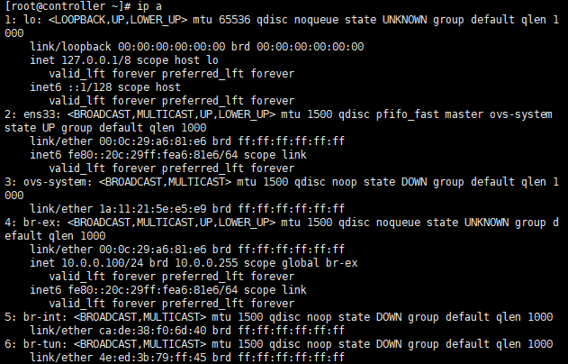
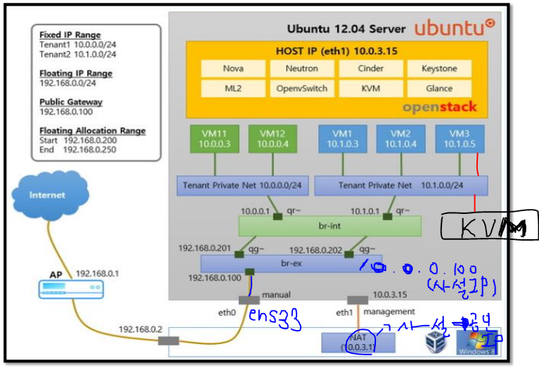

# 오픈스택 서비스

### 1. 오픈스택 설정 확인

### 2. Horizon (사용자 관점에서)

> **private cloud** 구축 완료

#### 2.1 사용자 설정

#### 2.2 인증 (keystone)

- **프로젝트** = 리소스 Quotas가 설정된 사용자 그룹이다.

- **관리자** 입장에서

---

> 사용자 account가 등록되어 있는 곳 : /etc/passwd, /etc/group, /etc/shadow <= **리눅스**

---

#### 2.3 관리(관리자 입장)

> `호스트 집합`은 compute host를 관리하기 위한 목적 -> 사용자x(안보임)
>
> `가용성 존`-> 사용자o(보임)
>
> `인스턴스` : Nova 서비스, 인스턴스를 생성할 수 있는 메뉴x, 관리 목적이다.
>
> `이미지` : Glance 서비스, 설치된 이미지 등록
>
> `Flavor` : 인스턴스 타입(AWS에서)과 비슷, 관리자가 생성할 수 있다.(서비스할 환경에 맞춰서 생성가능)
>
> `볼륨` : CINDER 서비스, 볼륨을 생성한 후 선택해서 사용할 수 있도록 함
>
> `네트워크` : NEUTRON 서비스, 가상 라우트 생성가능

- 시스템 정보(중요)

       

  

  

### 3. Horizon으로 사용 및 관리하기

1~11 : AWS의 ec2와 동일

12 : AWS의 S3와 동일

4~9 : Self-service

1~3 : IT 관계자

10 : Compute service(IaaS)

11 : AWS의 EBS와 동일

8 : 공인 IP, (Fixed IP : 사설 IP), AWS의 EIP개념과 비슷

#### 3.1 네트워크 생성

- Tenant Private Network 생성 (가상 네트워크 2개)

 두 네트워크를 연결하기 위해서 **`라우터`**를 이용한다.

VPC : 가상 네트워크

>  A 클래스 사설 IP : 10
>
> B 클래스 사설 IP : 172.16 ~ 172.31
>
> C 클래스 사설 IP : 192.168.0 ~ 255

##### int1 (private) <- subint1

- 192.168.0.0/24, Gateway(Router)

- 192.168.0.254

- DNS : 10.0.0.2

- DHCP

- Fixed IP (사설 ip)

  

##### web

- 192.168.0.1~253

##### ext1 (subext1)

- 외부 통신 (windows와 controller(CentOS))  -> xshell, ssh, web browser(windows)를 통해서 web에 접근이 가능한 상태로 만들어 준다.

- 네트워크 주소 정해짐 : 10.0.0.0/24
- Gateway : 10.0.0.2
- DNS : 10.0.0.2
- Floating IP (공인 ip)

- DHCP(X) -> pool(210~220) : 10.0.0.201,10.0.0.220 (콤마 앞뒤로 스페이스 x)

##### Router

- 각 네트워크를 연결 (ext1 & int1)

  

##### 외부네트워크

- 물리망과 연결이 필요 (br-ex와 ext1(Floating ip) 연결)

  

##### 게이트웨이 설정

- 외부네트워크와 Router를 연결

  

##### 내부 인터페이스

- 내부 인터페이스 추가 (Router와 int1(Fixed ip) 연결)

